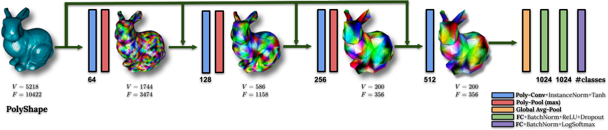

# PolyNet_Pytorch
This repository contains the official code to reproduce the results from the paper: 

**PolyNet: Polynomial Neural Network for 3D Shape Recognition with PolyShape Representation (3DV 2021)**

\[[project page](https://myavartanoo.github.io/polynet/)\] \[[arXiv](https://arxiv.org/abs/2110.07882)\] 


<p align="center">
  
</p>


### Dependencies
* Python 3.8.5
* PyTorch 1.7.1
* numpy
* Pillow
* torch_scatter

### Dataset
Download the preprocessed ModelNet dataset with PTQ and √3-subdivision from the follwing link and unzip them in the data directroy. The data type is ```.npz```.

\[[PTQ]()\] \[[√3-subdivision]()\] 


### Train
In ```config.json``` you can set dataset type (ModelNet10 or ModelNet40) and the PolyPool type (PTQ, Sqrt3).

To train PolyNet with the desired dataset and PolyPool, simply run, 

```
CUDA_VISIBLE_DEVICES=0 python train.py --config config.json -t "direction to save the model"
```


## Citation
If you find our code or paper useful, please consider citing

@article{Yavartanoo2021PolyNetPN,
  title={PolyNet: Polynomial Neural Network for 3D Shape Recognition with PolyShape Representation},
  author={Mohsen Yavartanoo and Shih-Hsuan Hung and Reyhaneh Neshatavar and Yue Zhang and Kyoung Mu Lee},
  journal={ArXiv},
  year={2021},
  volume={abs/2110.07882}
}
